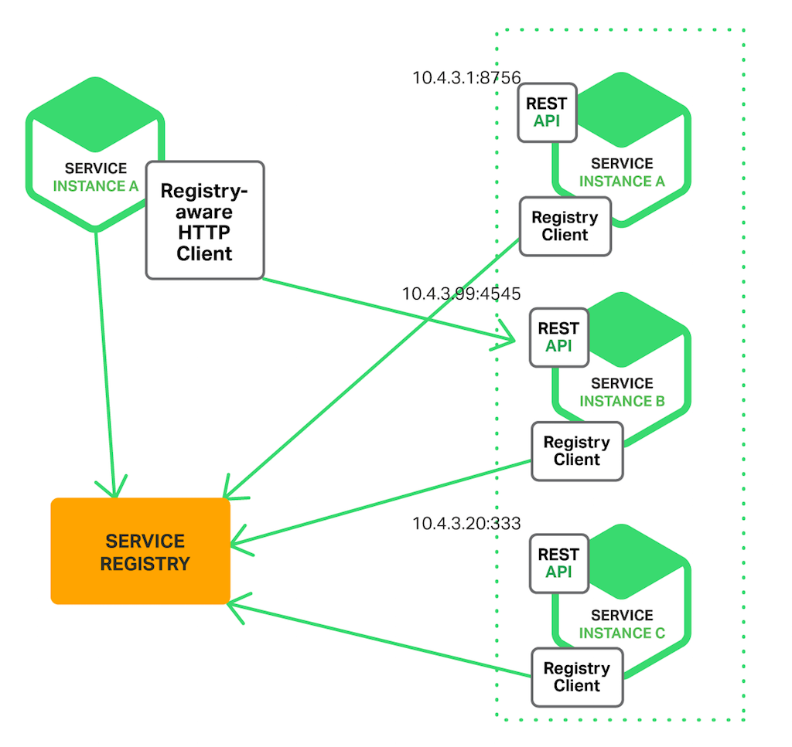
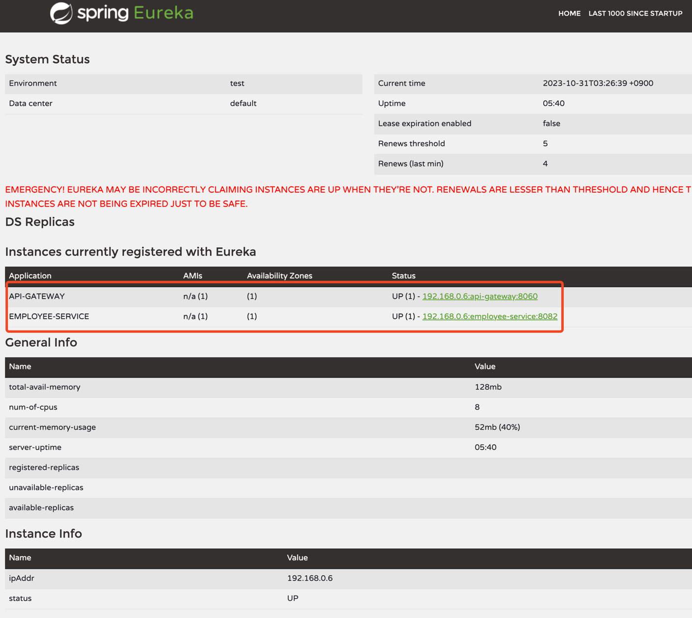

# About Eureka Server

간단하게 말해서 클라우드 환경에서, 지속적으로 생성, 파괴되는 인스턴스를 찾기 위한 네비게이션이다. 

네트워크 정보가 계속 바뀌는 상황에서 정확한 인스턴스를 찾아가는 역할을 하는 것이 Netflix Eureka 이다. 

- 서비스 인스턴스들이 시작되는 시점에 자신의 네트워크 주소를 유레카에 등록
- 유레카는 서비스 인스턴스의 상태를 계속 체크
- spring cloud gateway 를 통해 특정 path 에 해당하는 서비스를 찾아 로드 밸런싱

